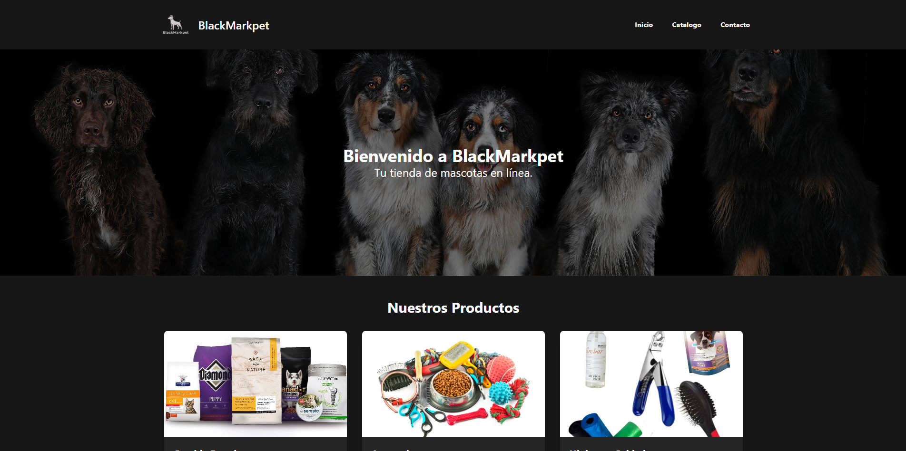

# BlackMarkpet 🐾 - Tienda para Mascotas

Este es un proyecto front-end para **BlackMarkpet**, una tienda de mascotas ficticia. Fue hecha para demostrar las habilidades de HTML5, diseño responsive con Tailwind CSS y DOM con JavaScript.



---

## ✨ Características Principales

El sitio web consta de tres páginas conectadas entre si que ofrecen una experiencia de usuario completa:

* **🏠 Página de Inicio (`index.html`):** Una página de aterrizaje atractiva que presenta la marca y dirige a los usuarios a las secciones clave.
* **🛍️ Catálogo de Productos (`detalles.html`):**
    * Los productos se cargan y se muestran dinámicamente desde un array de objetos en JavaScript, lo que facilita enormemente la gestión del inventario sin tocar el HTML.
    * Incluye una función para formatear precios a moneda local (CLP), demostrando la manipulación de datos.
* **✉️ Formulario de Contacto (`formulario.html`):**
    * Un formulario funcional con validación en tiempo real del lado del cliente.
    * Impide el envío de datos si los campos no son válidos y muestra mensajes de error claros y específicos para el usuario.
* **📱 Diseño Totalmente Responsive:**
    * Gracias a **Tailwind CSS**, la interfaz se adapta fluidamente a cualquier tamaño de pantalla, desde móviles pequeños hasta monitores de escritorio grandes.
    * Incluye un menú de navegación tipo "hamburguesa" para una experiencia móvil nativa.

---

## 🛠️ Tecnologías Utilizadas

Este proyecto fue construido utilizando tecnologías web estándar y herramientas modernas de desarrollo front-end.

* **HTML5**
* **Tailwind CSS**
* **JavaScript (ES6+)**
* **Node.js / npm** (Utilizado para el proceso de compilación de Tailwind CSS)

---

## 🚀 Cómo Ejecutar el Proyecto

Para ver y trabajar en este proyecto en tu máquina local, sigue estos sencillos pasos:

1.  **Descarga o Clona el Repositorio**
    ```bash
    # Si usas Git
    git clone https://github.com/Tavotsu/Tienda-de-mascotas-BlackMarkpet.git
    cd nombre-del-directorio
    ```

2.  **Instala las Dependencias de Desarrollo**
    Necesitarás Node.js y npm instalados. Abre una terminal en la raíz del proyecto y ejecuta:
    ```bash
    npm install tailwindcss @tailwindcss/cli
    ```
    Este comando instalará Tailwind CSS y otras herramientas necesarias.

3.  **Inicia el Compilador de Tailwind CSS**
    Para que los estilos se apliquen correctamente y se actualicen mientras desarrollas, ejecuta el siguiente comando. Este proceso vigilará tus archivos en busca de cambios y regenerará el archivo `output.css` automáticamente.
    ```bash
    npx @tailwindcss/cli -i ./src/input.css -o ./src/output.css --watch
    ```

4.  **Abre el Proyecto en tu Navegador**
    Con el comando anterior ejecutándose en la terminal, simplemente abre el archivo `index.html` en tu navegador web preferido (Google Chrome, Firefox, etc.).

    ¡Y listo! Ya puedes navegar por el sitio completo de BlackMarkpet.